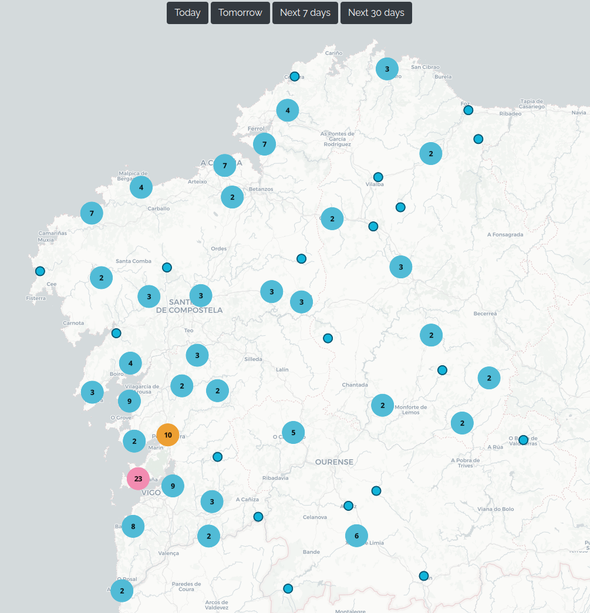

# Gzmusica map

[](https://github.com/IgnacioHeredia/gzmusica-map/actions/workflows/main.yml)

This is the source code to generate a map of scheduled events from [Gzmusica](http://www.gzmusica.com/) (Galician folk music gigs). It uses [Maplibre](https://maplibre.org/), an open source fork of [Mapbox](https://www.mapbox.com/), and open raster tiles from Carto/OSM (more options, [here](https://codepen.io/epidemiks/full/vKZQOz) and [here](https://wiki.openstreetmap.org/wiki/Tile_servers)).

 To generate an up-to-date map, first install the requirements:
```bash
pip install -r requirements.txt
```
then run:
```bash
python main.py 
```

It will generate a map (`axenda.html`) with the events for the next month, populated with the data from `gzmusica.geojson`. 

We provide a demo map of August 2021 that you can interact with. To use it:
1) open the [raw version of `axenda-demo.html`](https://raw.githubusercontent.com/IgnacioHeredia/gzmusica-map/master/htmls/axenda-demo.html), 
2) download with right click + 'Save as' 
3) open the html file.




Notes
=====
* Places are only accurate at the city level, not at the specific adresses. They extracted using the [OpenStreetMap Nominatim](https://nominatim.org/) service. We save the coordinates of places in `places.json` to avoid making duplicate calls to Nominatim. It allows also to add/correct places that are not found with Nominatim: just add them to `places.json`. 
* Ideally one would like to be able to continously filter events by date but it is a [pain in the ass](https://github.com/mapbox/mapbox-gl-js/issues/2613) because of the clusters. I ended up using buttons to set four different datasets (`Today`, `Tomorrow`, `This week`, `This month`), following [this](https://www.demo2s.com/javascript/javascript-mapbox-filtering-the-clustered-points-by-json-attributes-us.html). This is proper dirty but that's what you get when you barely know Javascript :). So this is my best shot.
* The price to pay for using free stuff is that the map uses raster tiles, not vector tiles. Therefore it doesn't look as crisp. If you want to use a vector map I have included `axenda_template-mapbox.html` where you can use your mapbox token to access Mapbox vector tiles (it allows 'only' 50K free views per month).
* Related to the above point, I set the scroll-zoom-rate to 1 and disabled the touch zoom to avoid having fractional zoom, which is convenient but makes the map appear very blurry when using raster tiles. For the same reason I also disabled map rotation.
